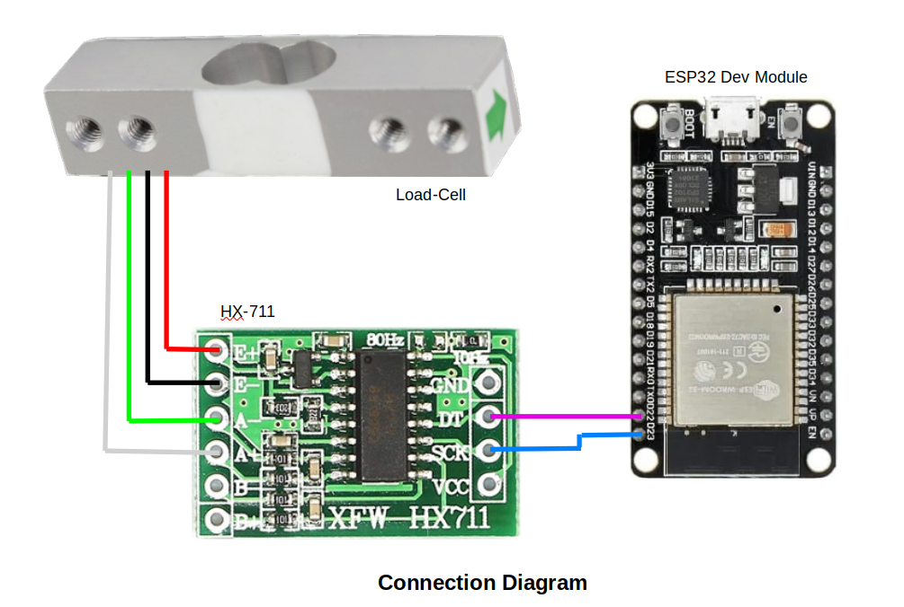

# Smart Weight Scale with ESP32 and Bluetooth BLE

**Introduction:**

Tracking your weight goals and progress can be difficult without accurate data. In this guide, we’ll walk through how to build your own smart weight scale using an ESP32 and Bluetooth BLE. Creating your own connected scale is an excellent way to monitor your fitness routine and health goals. Plus, it’s a fun electronics project!

**Prerequisites:**

1. ESP32 Development Board
2. Load Cell and HX711 Amplifier
3. VSCode with PlatformIO (IDE) installed
4. Wiring diagram:
<br>


<br><br>

**Step 1: Set Up VSCode with PlatformIO:**

We'll use PlatformIO as the IDE to code and upload the firmware to the ESP32. Install VSCOde and PlatformIO extension to get started. Create a new project for your smart scale application.
<br><br>

**Step 2: Connect the Hardware:**

Follow the wiring diagram above to connect the ESP32 with the load cell, HX711 amplifier and Bluetooth BLE module. Some key connections:

- HX711 CLK pin to ESP32 GPIO 14
- HX711 DOUT pin to ESP32 GPIO 27

Initialize the components:

```arduino
HX711 scale;

BLEDevice bleDev;
```
<br>

**Step 3: Install Libraries:**

In `platformio.ini`, add dependencies for the HX711 and BLE Arduino libraries:

```ini
[env:esp32dev]
platform = espressif32
board = esp32dev
framework = arduino

; uncomment port config for linux platform
; upload_port = /dev/ttyACM0
; upload_speed = 115200

; uncomment this line if you get low memory error
; board_build.partitions = huge_app.csv
```
<br>

**Step 4: Write the Code:**

Let's look at some key sections of the code:

Set up the HX711 scale and calibrate the sensor readings:

```arduino
// Initialize scale
scale.begin(DATA_PIN, CLK_PIN);

// Calibrate with known weight
scale.set_scale(2280.f);
scale.tare();
```

Read the weight and broadcast via BLE:

```arduino
// Get weight data
float weight = scale.get_units();

// Broadcast via BLE
bleDev.broadcastWeight(weight);
```
<br>

**Step 5: Upload the Firmware**

With everything wired up and coded, upload the firmware to your ESP32 via USB.
<br><br>

**Step 6: Test It Out and Calibration**

Place some known weights on the scale and verify the readings are accurate. Check that the values are being broadcast over BLE as expected.
<br><br>

**Conclusion**

In this project, we built a smart Bluetooth-BLE scale with an ESP32 and load cell sensor. Stay tuned for a future guide on developing an Android app to display and track the weight data. 

Let me know if you have any other questions!
